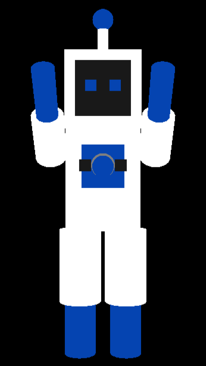
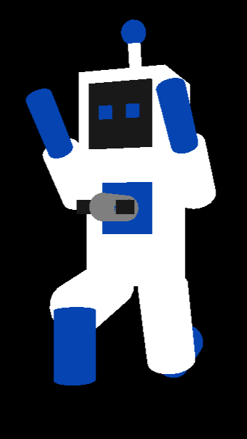

# 🤖 Robot Shootout

**Robot Shootout** is a real-time 3D defense game developed in C++ using OpenGL and FreeGLUT. Players control a rotating cannon to shoot incoming robots before they reach the center point.

---

## 🎮 Features

- 🌍 Textured 3D environment
- 🔫 Controllable rotating cannon
- 🧱 Custom OBJ mesh loading
- 🎥 Free-look camera controls
- 🏃 Procedural walking animation
- 🧱 Textured ground and cannon models

---

## 📸 Screenshots

<p align="center">
  
  
</p>

<p align="center">
  <em>Front and side views of the robot model.</em>
</p>

---

## 🧰 Tech Stack

- **Language**: C++
- **Graphics**: OpenGL, FreeGLUT
- **Textures**: BMP image loading
- **3D Models**: Custom `.obj` mesh parser
- **Dependencies**:
  - [GLEW](http://glew.sourceforge.net/)
  - [FreeGLUT](http://freeglut.sourceforge.net/)

---

## 🚀 How to Run

1. **Install OpenGL & FreeGLUT/GLEW**
   - Windows users: Make sure `.dll` files are available in your `PATH` or project directory.
2. **Clone the repo**
   ```bash
   git clone https://github.com/yourusername/RobotShootout.git
   cd RobotShootout
3. **Build the project**
   - Open the `.sln` file in Visual Studio
   - Build in `x64/Release` or `Debug` mode

4. **Run the executable**
   - Controls:
     - `Mouse Drag` – Rotate the camera
     - `Spacebar` – Shoot projectiles
     - `S` – Spawn robots
     - `R` – Reset robot wave

---

## 📝 Notes

- Ensure the working directory is set correctly so the game can locate textures in the `assets/` folder.
- `.obj` mesh files and `.bmp` textures must be present for the visuals to load properly.

---

## 🧠 Acknowledgements

- [FreeGLUT](http://freeglut.sourceforge.net/)
- [GLEW](http://glew.sourceforge.net/)

---

## 🪪 License

MIT License © [Matthew Lew](https://github.com/Matthew-J-Lew)

[](https://github.com/Matthew-J-Lew)
[](https://www.linkedin.com/in/matt-j-lew/)
